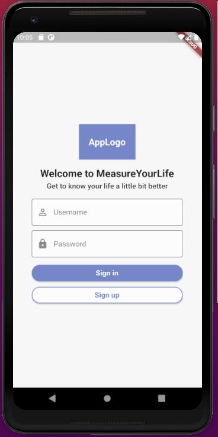
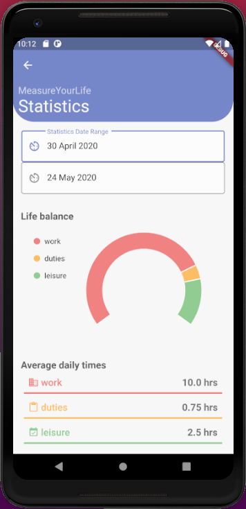

# MeasureYourLife

## MYL is an open-source project to build a mobile app that helps keeping track with what we spend our time on

Repository Table of Contents:

1. **root directory**
    - Docker-compose definition for backend container infrastructure
    - Travis CI definition
    - CI/CD agent requirements
    - Flake8 compliance check config

2. **api_backend_server** -> more on that [here](api_backend_server/README.md)
    - Flask REST-API webserver, with Connexion, JWT, Swagger UI, and SendGrid Integration
    - Backend requirements
    - Backend setup instructions
    - OpenAPI 3.0 definition
    - Integration tests
    - Unit tests

3. **mongo_db** -> more on that [here](mongo_db/README.md)
    - MongoDB database initialization script
    - Dummy data insert script

4. **mobile_app** -> more on that [here](mobile_app/README.md)
    - Mobile application dependencies
    - Mobile application source code
    - Development environment setup instructions

5. **test_scenarios** -> Table of Content [here](test_scenarios/README.md)
    - Functional test scenarios for the mobile app (only in Polish)

   